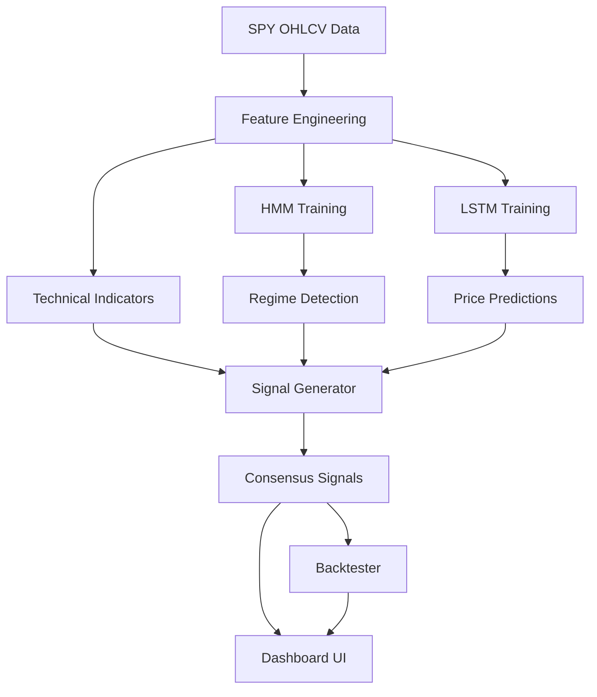

# SPY Analytics Dashboard

A production-ready **SPY ETF Analytics Dashboard** built with Next.js, TypeScript, and Tailwind CSS. Features Hidden Markov Models (HMM) and LSTM neural networks running entirely in the browser for market regime detection, price prediction, and multi-model consensus trading signals.

## Features

- **HMM Regime Detection** — 3-state Gaussian HMM (Baum-Welch + Viterbi) identifies Bear, Neutral, and Bull market regimes
- **LSTM Price Prediction** — Recurrent neural network predicts next-day prices and generates 10-day forecasts
- **Multi-Model Signal Generation** — Consensus BUY/SELL signals from 4 sources: HMM regimes, SMA crossovers, LSTM predictions, MACD crossovers
- **Backtesting Engine** — Simulates trading strategy with equity curve, win rate, Sharpe ratio, and max drawdown
- **Technical Indicators** — SMA, EMA, MACD, RSI, Bollinger Bands, ATR, and more
- **Interactive Dashboard** — 6-tab layout with dark financial terminal aesthetic
- **Client-Side ML** — All models train in the browser with no backend required

## Tech Stack

| Layer | Technology |
|-------|-----------|
| Framework | Next.js 14 (App Router) |
| Language | TypeScript |
| Styling | Tailwind CSS |
| Charts | Recharts |
| ML Models | Custom TypeScript (no external ML libs) |
| Deployment | Static export (GitHub Pages / Vercel) |

## Architecture



## Dashboard Tabs

| Tab | Description |
|-----|-------------|
| **Overview** | Price chart with SMA/Bollinger Bands, volume, returns, RSI |
| **Signals** | Buy/sell signals, signal log, backtest results, equity curve |
| **HMM** | Regime chart, transition matrix, state parameters, convergence |
| **LSTM** | Prediction vs actual, loss curve, 10-day forecast, error distribution |
| **Compare** | Combined model view, LSTM error by regime, model summary |
| **Settings** | Configurable hyperparameters, retrain models, export data |

## Getting Started

```bash
# Install dependencies
npm install

# Start development server
npm run dev

# Build for production
npm run build

# Type check
npm run type-check

# Lint
npm run lint
```

Open [http://localhost:3000](http://localhost:3000) to view the dashboard.

## How the Models Work

### Hidden Markov Model (HMM)
The HMM models daily returns as emissions from a latent Markov chain with 3 hidden states. The Baum-Welch algorithm (Expectation-Maximization) learns the state parameters (mean return, volatility) and transition probabilities. The Viterbi algorithm then decodes the most likely sequence of market regimes.

### LSTM Neural Network
A simplified recurrent neural network with gating mechanisms processes sequences of normalized closing prices (20-day lookback window). Trained via backpropagation through time with MSE loss, it learns to predict the next day's price. The trained model also generates 10-day forward forecasts.

### Signal Consensus
Four independent signal sources vote BUY, SELL, or HOLD:
1. **HMM** — Regime transitions (Bear to Bull = BUY)
2. **SMA** — Golden Cross / Death Cross
3. **LSTM** — Directional price predictions
4. **MACD** — Signal line crossovers

A signal is emitted when BUY votes >= SELL votes (and at least 1 BUY), or SELL votes > BUY. Signal strength (1-4) indicates agreement level.

## Deployment

### GitHub Pages
The GitHub Actions workflow automatically builds and deploys on push to `main`.

### Vercel
Connect the repository to Vercel for automatic deployments.

## License

MIT

## Disclaimer

This application is for **educational and research purposes only**. It does not constitute financial advice. The models are simplified implementations trained on historical data and have no predictive power over future market movements. Past performance does not guarantee future results. Always consult a qualified financial advisor before making investment decisions.
